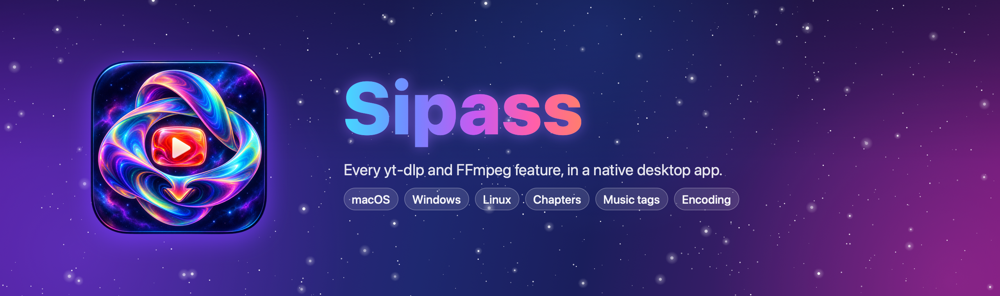

<p align="center">
  
</p>

<p align="center">
  <a href="https://github.com/dustalexw/ytdlp-studio/releases/latest"></a>
  <a href="https://github.com/dustalexw/ytdlp-studio/actions/workflows/build.yml"></a>
  
</p>

<p align="center">
  <a href="https://github.com/dustalexw/ytdlp-studio/releases/latest"><b>Download for macOS</b></a>
  &nbsp;·&nbsp;
  <a href="https://github.com/dustalexw/ytdlp-studio/releases/latest"><b>Download for Windows</b></a>
  &nbsp;·&nbsp;
  <a href="https://github.com/dustalexw/ytdlp-studio/releases/latest"><b>Download for Linux</b></a>
</p>

A native desktop front end for **yt-dlp** and **FFmpeg**, with SwiftUI on macOS,
Windows Forms on Windows and Avalonia on Linux. Every major yt-dlp
feature is a checkbox, picker or slider, and the exact command is shown live at the
bottom of the window so you can copy it into Terminal.

The bespoke psychedelic space icon, with an iridescent orbital form, a subtle central
YouTube play mark, and an integrated download arrow, ships on every platform. The
1024px source is in `Assets/AppIcon.png`; `AppIcon.icns` contains the native macOS
icon sizes and `Windows/App/AppIcon.ico` the Windows ones.

Sipass was previously called YT-DLP Studio; settings and presets from earlier
versions carry over.

The interface takes its look from the icon on all three platforms: a deep-space
backdrop, frosted panels with an iridescent edge, a compact link field and a glowing
Download button. Choose **System**, **Light** or **Dark** under Settings → Appearance.

## Windows portable edition

The Windows x64 edition includes the .NET desktop runtime, yt-dlp, FFmpeg, ffprobe
and Deno. Extract the entire ZIP and open `Sipass.exe`; no dependencies need
to be installed separately. See [Windows instructions and build details](Windows/README.md).

## Linux portable edition

The Linux x64 edition bundles the .NET runtime, yt-dlp, FFmpeg, ffprobe and Deno.
Extract the `.tar.gz`, run `./Sipass`, and optionally `./install.sh` to add it to
your applications menu. See [Linux instructions and build details](Linux/README.md).

## macOS requirements

- macOS 13 Ventura or later (Apple Silicon or Intel)
- Swift 5.9+ — Xcode 15+, or just the Command Line Tools (`xcode-select --install`)
- yt-dlp and FFmpeg: `brew install yt-dlp ffmpeg`

The app looks in `/opt/homebrew/bin`, `/usr/local/bin`, `/opt/local/bin`, `~/.local/bin`
and `~/bin`. You can point it somewhere else in **Settings (⌘,)**.

## Build and run

```bash
./build.sh            # → build/Sipass.app
open "build/Sipass.app"

./build.sh install    # also copies it to /Applications
./build.sh universal  # arm64 + x86_64 (needs full Xcode)
```

For development: `swift run`, or `open Package.swift` to work in Xcode (choose the
“My Mac” destination and press ⌘R).

> If you move the code into an Xcode **App** project instead, turn off **App Sandbox**
> under Signing & Capabilities. A sandboxed app can't launch Homebrew binaries.

## Features

**Format & quality** — container (MP4, MKV, WebM, MOV, AVI, FLV), maximum resolution
(144p–8K), frame-rate cap, preferred video codec (H.264, HEVC, VP9, AV1) and audio codec
(AAC, Opus), a “no conversion needed” preference, forced remux, plus raw `-f` / `-S`
fields. **Analyze (⌘I)** lists every stream in a table; pick one video and one audio
stream and it fills in the format ID for you.

**Audio only** — MP3, M4A, AAC, Opus, Vorbis, FLAC, ALAC, WAV, or the original codec,
with VBR or CBR quality. FFmpeg filters: EBU R128 loudness normalization, volume
gain, sample-rate conversion and mono/stereo downmix.

**FFmpeg encode** — an optional second pass on each downloaded video: x264, x265,
VideoToolbox H.264/HEVC (hardware), VP9, SVT-AV1 or ProRes 422 HQ, with CRF or bitrate,
speed preset, downscaling and audio re-encode. Optionally replaces the original
(which goes to the Trash). Also a raw `--postprocessor-args` field.

**Chapters & SponsorBlock** — choose YouTube chapters, comment timestamps, or comments
only when YouTube chapters are missing; preview and select a comment track list; embed chapters, split into one file per chapter
(optionally into a folder), remove chapters by regex, and SponsorBlock mark-or-cut for
every category.

**Subtitles** — manual and auto-generated captions, language selection with regex,
conversion to SRT/VTT/ASS/LRC, and embedding.

**Metadata & thumbnails** — embed tags and cover art, save the thumbnail
(with JPG/PNG/WebP conversion), description, `.info.json` and comments.

**Music tags** — on by default for audio downloads, so files sort properly in Apple Music,
iTunes, VLC and other players. Cleans titles (“Official Video”, “Lyrics”, “[4K]”…),
splits “Artist - Song” titles, strips “- Topic”/“VEVO” from channel names, numbers tracks
by playlist position (“3 of 14”), fills in album, album artist and year, and crops the video
thumbnail into a square cover. Official YouTube Music details are kept. When an album is split by
chapters, every track gets its own title, number and cover. Optional genre, plus “Artist - Song”
and “Artist / Album / 01 Song” file-name templates. Works with MP3, M4A, FLAC, Opus and Vorbis.

**Trim** — download only a time range, with optional frame-accurate cuts.

**Playlist** — single video vs whole playlist, item ranges like `1-5,8,-3::`, and a
download archive so re-runs skip what you already have.

**Network & login** — rate limit, parallel fragments, retries, sleep between
downloads, proxy, and cookies from Safari, Chrome, Firefox, Brave, Edge and others.

**Output** — folder picker, file-name templates (including channel and playlist
folders) or your own, safe-ASCII names, overwrite and file-date behavior.

**Advanced** — free-form extra arguments with one-click snippets.

**Queue** — several downloads at once (configurable), live progress, speed, ETA and
size, post-processing stage, per-job log, cancel, retry and Show in Finder.

**Presets** — nine built-ins (Best MKV, Compatible MP4, MP3 320, FLAC, Podcast,
Album split, Ad-free, Shrink for sharing, Archive) plus your own. Settings persist
between launches.

## Notes

- **Cookies from Safari** need Full Disk Access for the app
  (System Settings › Privacy & Security › Full Disk Access).
- If a site stops working, use **Settings › Update yt-dlp**
  (or `brew upgrade yt-dlp` for Homebrew installs).
- Only download content you have the right to download.

## Build without a Mac toolchain

Push this folder to a GitHub repository. `.github/workflows/build.yml` builds and tests the
universal macOS app and the Windows portable edition on GitHub's runners. Download
`Sipass-<version>-macOS.zip` from the run's **Artifacts** section. The app is ad-hoc
signed, so the first time, right-click it and choose **Open**.

To publish a release with both builds, set `VERSION` at the top of the workflow, then run it
manually on `main` with **Publish this version** enabled. It publishes only after both
platforms pass and never overwrites an existing release.

## Tests

`LinuxHarness/` compiles the app's real (symlinked) core sources on Linux against tiny
Combine/AppKit stand-ins, then drives the actual `DownloadManager` against real yt-dlp and
FFmpeg, verifying every output with `ffprobe`: all presets accepted by yt-dlp, video/audio
downloads, filters, trimming, all five software encoders, cancel, retry and queueing.
The SwiftUI layer can only be built on macOS.

```bash
bash LinuxHarness/run-tests.sh     # Ubuntu 24.04 with Swift 6
```

## Project layout

```
Package.swift
build.sh
Sources/YTDLPStudio/
  YTDLPStudioApp.swift          app entry, scenes
  Models/Options.swift          every option + enums
  Models/OptionsStore.swift     persistence and presets
  Services/CommandBuilder.swift options → yt-dlp / ffmpeg arguments
  Services/DownloadManager.swift queue, progress parsing, encode pass
  Services/ProcessRunner.swift  streaming process wrapper
  Services/ToolLocator.swift    finds yt-dlp / ffmpeg
  Services/MetadataFetcher.swift Analyze (yt-dlp -J)
  Services/ChapterTagger.swift  per-track tags for split albums
  Views/…                       SwiftUI interface
```

## Chapters from YouTube comments

In **Chapters & SponsorBlock**, choose **Comments** or **Comments if chapters are missing**.
Paste an individual video link and click **Find chapters in comments** to preview candidates,
then choose **Use these chapters**. Download normally to embed or split those chapters.
Selections apply only to that video and remain in memory for this window; queued jobs retain
their selection when retried. The source setting is saved with settings and presets.

Without a manual selection, each video uses the valid comment list with the most chapters,
then the most likes. Searches examine up to 200 top-level comments sorted by YouTube's Top
order; a list outside that sample may not be found. Fetching can be cancelled. Lists need
at least three titled, increasing timestamps within the video's known duration, one per
line. Both `0:00 Intro` and `Intro – 0:00` work, including hour timestamps. A list that starts
after zero gets an Opening chapter, preserving the beginning of the video.

**Comments** stops the job if no valid list is available, or if a manually selected comment
is no longer found. **Comments if chapters are missing** keeps existing YouTube chapters
and otherwise allows a download without chapters if no list is found. Playlist selections
are processed per video; use individual video links to preview a specific track list.
Comment fetching respects the browser cookie and proxy settings. The copied download
command does not perform the app's comment preprocessing.

Run the parser, metadata, queue and splitting checks on macOS with `swift test`.
